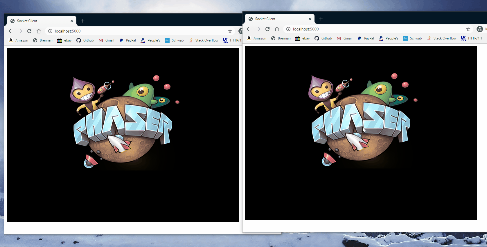
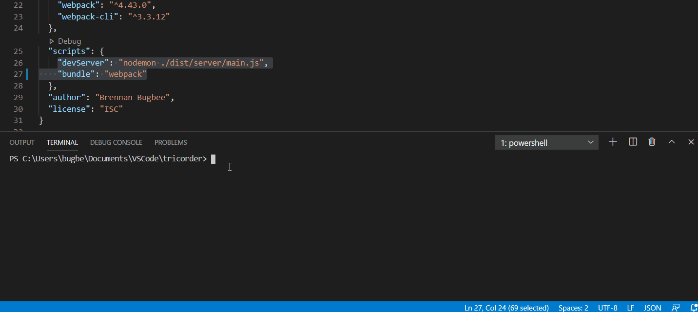

# Tricorder - TS
## A back-end template package for Phaser.js and other html game frameworks

### **Make real-time multiplayer games and store player information in a database**

### **Use simple node commands to make development smooth and painless**

To get started, make sure node.js is installed and clone the repo. Then install the dependencies with `npm install`.

This template provides a development environment written in Typescript for Phaser games (or any html based library) by utilizing a few common node modules like [Socket.IO](https://socket.io/docs/), [TypeOrm](https://typeorm.io/#/), and Http. It works by running an http server with bound websocket and rendering files to the browser that are used to run the game. Although you can use Javascript, Typescript makes development cleaner and easier in a variety of way: 
- Smart Completions
- Scalability
- Readability

There are two commands: 
- `npm run devServer`
: Runs the development server on localhost and automatically restarts the server when file changes are detected. It also initializes a connection to a sqlite database configured with 'ormconfig.json'.
- `npm run bundle`
: Runs webpack to create a bundled Javascript file that is client on request and automatically re-bundles when file changes are detected.

Later updates may include:
- Production-ready environment
- Better documentation
- Dependency injection
